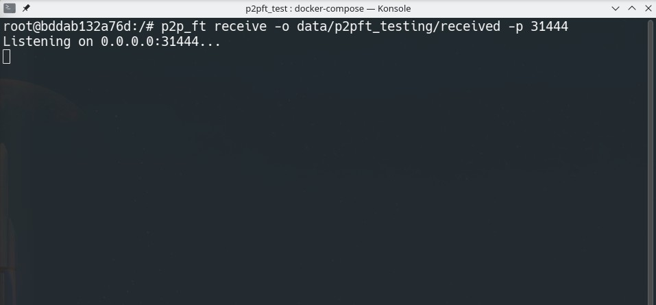
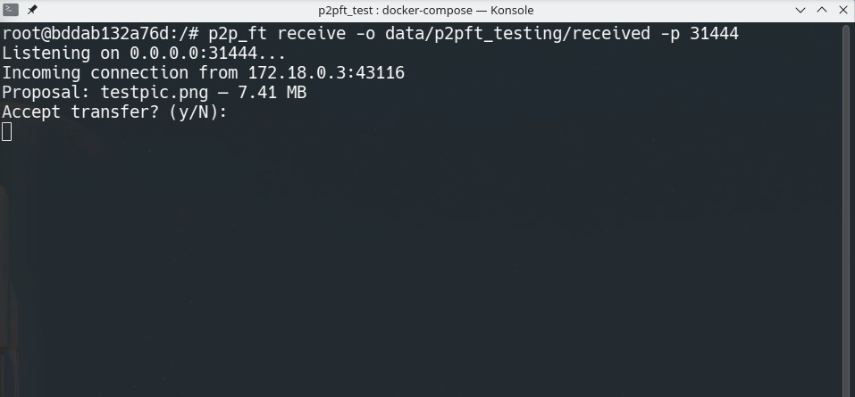
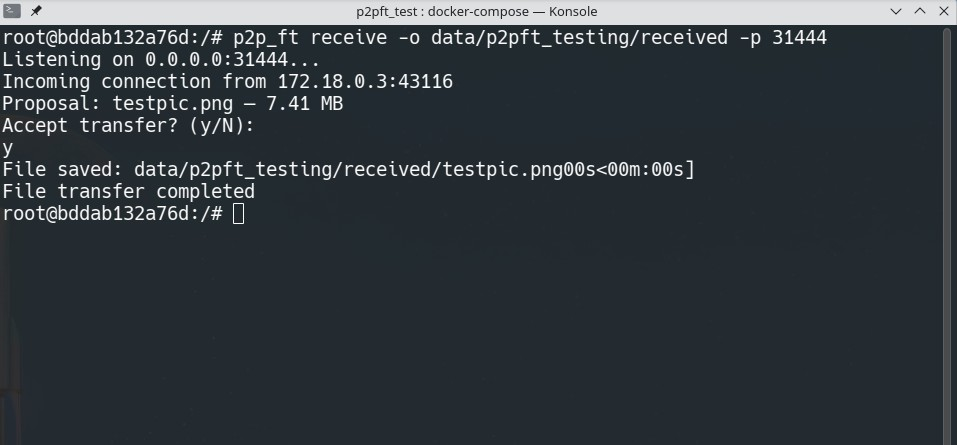
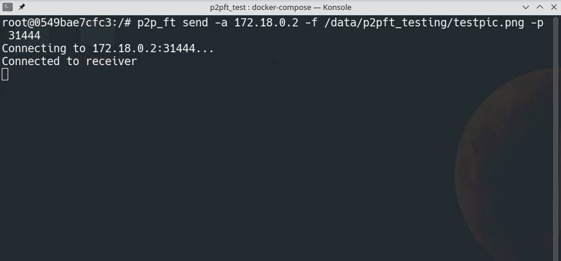
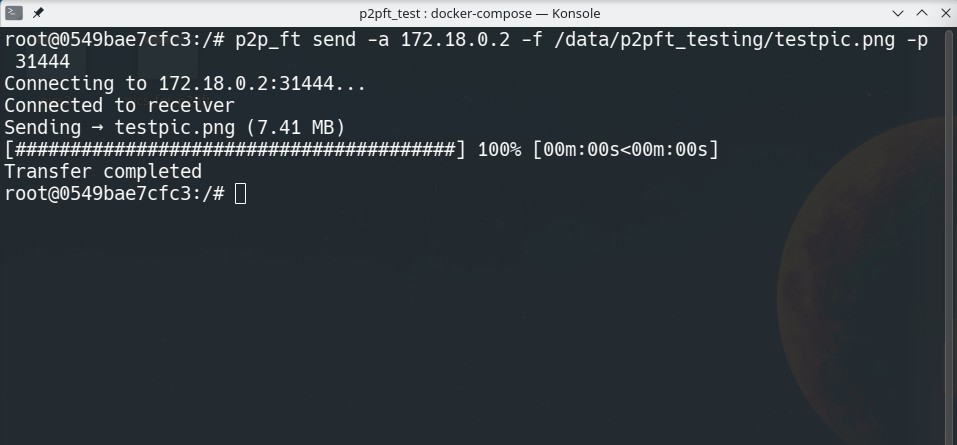

# p2p_file_transfer

A minimal peer-to-peer file transfer tool for Linux written in modern C++23.

The program operates in two modes:
- **Sender** - Connects to a receiver, proposes a file transfer, and streams the file in chunks
- **Receiver** - Listens for incoming connections, accepts or rejects transfer proposals, and saves received files to disk

## Features

- **TLS 1.2+ Encryption** - All communication is encrypted using modern cipher suites (AES256-GCM, AES128-GCM with ECDHE)
- **Self-Signed Certificates** - Automatically generates ECDSA certificates (secp256r1) on first run, stored in `~/.config/p2p_ft/`
- **Protocol Buffers** - Structured message protocol with 8-byte headers for reliable communication
- **Interactive Transfer Approval** - Receiver must manually accept incoming file transfers
- **Progress Tracking** - Real-time progress bar with elapsed time and ETA
- **Chunked File Transfer** - Files are split into 8KB chunks for efficient streaming with 4MB buffered writes on the receiver side

## Dependencies

This project uses [vcpkg](https://vcpkg.io/) for dependency management.

| Library | Version | Purpose |
|---------|---------|---------|
| [CLI11](https://github.com/CLIUtils/CLI11) | >= 2.5.0 | Command-line argument parsing |
| [Boost.Asio](https://www.boost.org/doc/libs/release/doc/html/boost_asio.html) | >= 1.89.0 | Asynchronous networking with SSL support |
| [OpenSSL](https://www.openssl.org/) | >= 3.6.0 | TLS/SSL encryption |
| [Protocol Buffers](https://protobuf.dev/) | >= 5.29.5 | Message serialization |
| [Botan](https://botan.randombit.net/) | >= 3.7.1 | Certificate generation (ECDSA) |
| [indicators](https://github.com/p-ranav/indicators) | >= 2.3 | Progress bar visualization |
| [Google Test](https://github.com/google/googletest) | >= 1.17.0 | Unit testing |

## How to Build

### Prerequisites

- CMake 3.31 or higher
- GCC or Clang with C++23 support
- vcpkg package manager
- VCPKG_ROOT env variable has to be set to vcpkg install directory
- Ninja build system (recommended)

### Build Steps

1. Clone the repository:
```bash
git clone https://github.com/yourusername/p2p_file_transfer.git
cd p2p_file_transfer
```

2. Configure with CMake using one of the available presets:
```bash
# Debug build with GCC
cmake --preset x86_64-linux-gcc-debug

# Release build with GCC
cmake --preset x86_64-linux-gcc-release

# Debug build with Clang
cmake --preset x86_64-linux-clang-debug

# Release build with Clang
cmake --preset x86_64-linux-clang-release
```

3. Build the project:
```bash
cmake --build --preset <preset-name>
```

### Usage

**Receiver mode** - Start listening for incoming transfers:
```bash
./p2pft --mode receiver --port 8080 --output-dir /path/to/save/
```

**Sender mode** - Send a file to a receiver:
```bash
./p2pft --mode sender --address 192.168.1.100 --port 8080 --file /path/to/file.zip
```

## Third-Party Libraries

All dependencies are managed through vcpkg and are not vendored in the repository:

- **Boost.Asio** - Provides cross-platform asynchronous I/O with SSL/TLS support via OpenSSL wrapper
- **Protocol Buffers** - Google's language-neutral serialization format for the message protocol
- **OpenSSL** - Industry-standard TLS implementation for secure communication
- **Botan** - Modern C++ cryptography library used for generating self-signed ECDSA certificates
- **indicators** - Header-only library for terminal progress bars with multi-threading support
- **CLI11** - Modern C++ command-line parser

## Screenshots

### Receiver




### Sender


